# Module de programmation 
avancée

Introspection, Annotations, Persistance
Master 1 MIAGE – Année 2025-2026
Philippe Lahire

---

Lien avec les autres UE :
l’UE « Cadrage d'un projet informatique »

17/10/2025
Module de Programmation Avancée (application au langage Java)
2

• Compléments :
• Rappel sur la gestion des flots de données
• Chargement dynamique
• Classes Internes

• Réflexivité et Introspection 
• Annotations
• Persistance / Sérialisation

# Sommaire

---

17/10/2025
Module de Programmation Avancée (application au langage Java)
3

• 4 séances de cours 2 heures
• 5 séances de TP/TD de 2 heures
• Une note de TP/TD 
• TP Noté
• Réponses aux questions
• Qualité des exercices
• Une note d’examen de contrôle continu

# Agenda

---

17/10/2025
Module de Programmation Avancée (application au langage Java)
4

### • Pas de problème tant que vous comprenez et gardez un esprit critique 
sur le rendu de l’IA
• Sur la partie TP, pas de problème si vous voulez utiliser l’IA
• Mais :
• Je dois vous évaluer de manière équitable
• Je dois évaluer votre niveau de compréhension (pas celle de l’IA)

Une évaluation  sur machine (sans restriction internet)
Une évaluation sur papier (compréhension + bouts de code)

# Utilisation de l’IA

---

# Programmation Avancée

Réflexivité et Introspection
Philippe Lahire

---

Module de Programmation Avancée (application au langage Java)
6
17/10/2025

Rectangle a;… a.resize(2,3)

Un langage réflexif peut utiliser :
• Introspection
• Intercession

# Les langages réflexifs

### Réflexion / Réflexivité

Exemple de 
mise en œuvre :

---

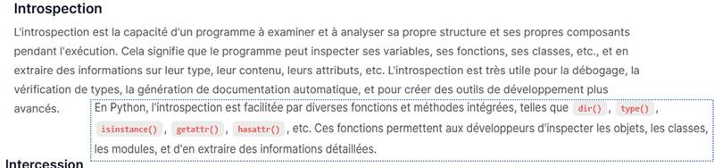

Aspect-
Oriented
Programming

17/10/2025
Module de Programmation Avancée (application au langage Java)
7

le

# Introspection vs intercession

---

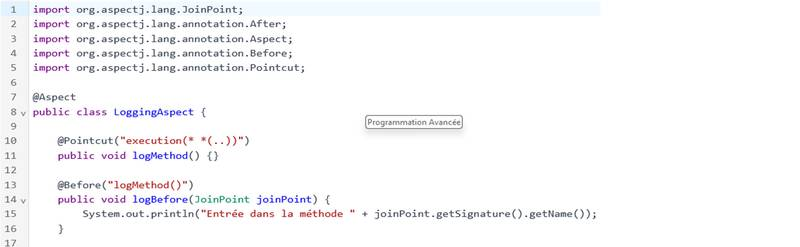

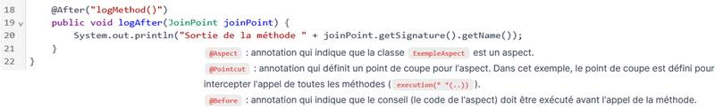

17/10/2025
Module de Programmation Avancée (application au langage Java)
8

# Un exemple de AspectJ (AOP)

---

• Ruby: Introspection et Intercession (alias_method, define_method, méthodes magiques)

17/10/2025
Module de Programmation Avancée (application au langage Java)
9
Mais aussi  Perl, Groovy, R ….

• Javascript : introspection et une certaine forme d’intercession (proxy)

Castle 
• Java: introspection (persistance: une certaine forme d’intercession)

# Classification de quelques langages réflexifs

• PHP : Introspection et Intercession (méthodes magiques)

• C# : introspection et une certaine forme d’intercession

Accès, mise à jour d’une propriété, destruction objet

Conversions, initialisation, comparaison, etc.

• Python : Introspection et Intercession

---

| catégorie | Python | JavaScript | Ruby | PHP | C# | Java |
| --- | --- | --- | --- | --- | --- | --- |
| Infos attribut | x | x | x | x | x | étendues |
| Lire valeur attribut | x | x | x | x | x | x |
| Modif. Valeur attribut | x | x | x | x | x | x |
| infos type | Nom uni. | Nom uni. | x | x | x | x |
| infos classe | basique |  | x | x | x | x |
| infos méthode | source |  | x | x | x | x |
| infos paramètres | x |  | x | x | x | x |
| Exécution méthode | x | x | x | x | x | x |
| infos parents/sousclasses | x |  | x | x | x | x |
| infos classes internes |  |  |  | Traits (framework) | oui | x |
| Ajout dans méthode | x | N (proxy) | Méth magiques | Méth magiques | Castle | non |
| Ajout/supp méthode | x | x | define_method | non | non | non |
| Ajout/supp attribut | x | x |  | non | non | non |
| Impl. constructeur |  | x |  | x | x | x |

# Classification de quelques langages réflexifs

---

17/10/2025
Module de Programmation Avancée (application au langage Java)
11

# Python et l’introspection

---

17/10/2025
Module de Programmation Avancée (application au langage Java)
12

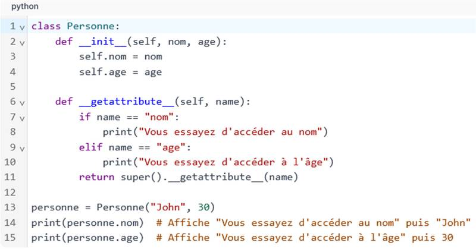

# Python et l’intercession

---

17/10/2025
Module de Programmation Avancée (application au langage Java)
13

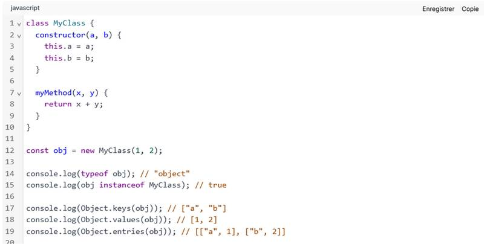

# JavaScript et l’introspection

---

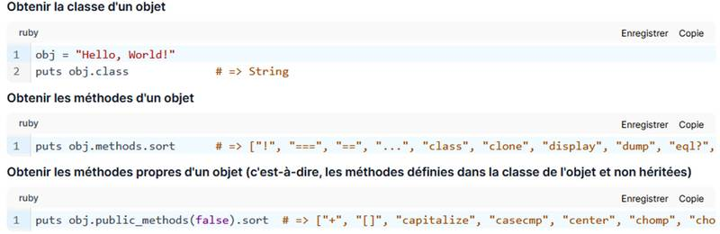

17/10/2025
Module de Programmation Avancée (application au langage Java)
14

# Ruby et l’introspection

---

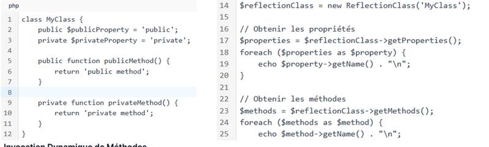

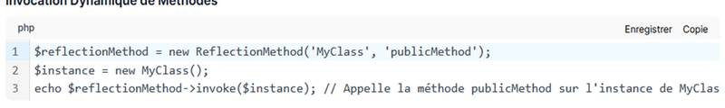

17/10/2025
Module de Programmation Avancée (application au langage Java)
15

# PHP et l’introspection

---

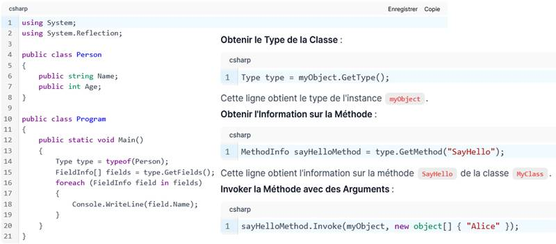

17/10/2025
Module de Programmation Avancée (application au langage Java)
16

# C# et l’introspection

---

Module de Programmation Avancée (application au langage Java)
17
17/10/2025

### Java = introspection réflexive, pas de protocole de méta-programmation

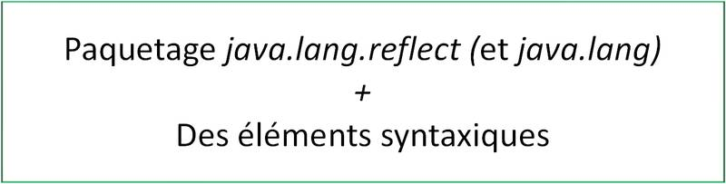

Paquetage java.lang.reflect (et java.lang) 
+ 
Des éléments syntaxiques

# Et dans Java…

---

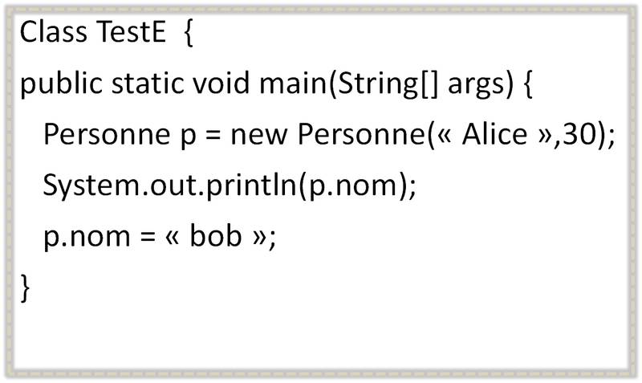

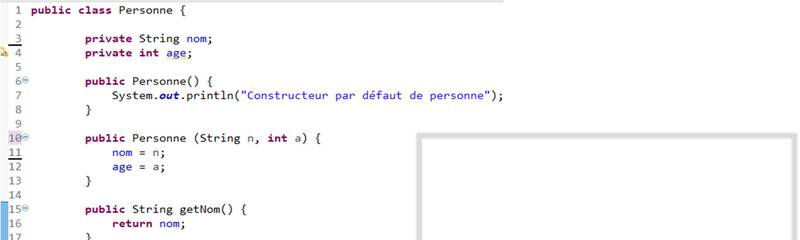

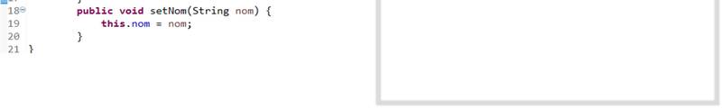

Class TestE {
public static void main(String[] args) {
Personne p = new Personne(« Alice »,30);
System.out.println(p.nom);
p.nom = « bob »;
}

Class TestE {
public static void main(String[] args) {
Personne p = new Personne(« Alice »,30);
System.out.println(p.nom);
p.nom = « bob »;
}

17/10/2025
Module de Programmation Avancée (application au langage Java)
18

# Ce n’est pas ici de l’introspection

---

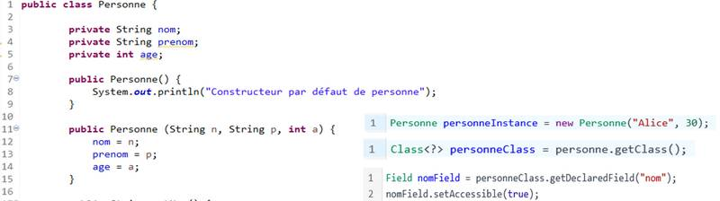

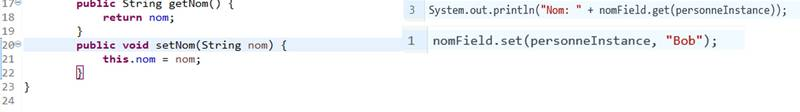

17/10/2025
Module de Programmation Avancée (application au langage Java)
19

# C ’est de l’introspection

---

Pas de nom de classe 
dans le code…

Environnements de développement 
Echange de classe dans les systèmes distribués
Programmation d’outils spécifiques

17/10/2025
Module de Programmation Avancée (application au langage Java)
20

• Affichage d’informations sur le contenu des classes
• Exécution de méthodes 
• Modification/consultation de la valeur des champs
• …
• Débogage de programmes
• JUNIT 
• Utilisation couplée avec les annotations :
• JPA (Java Persistence API): Mise en correspondance modèle Objet/Relationnel
• Hibernate, OpenJDO
• Framework Spring
• ….

# Réflexivité et introspection : Quelle utilisation ?

Au niveau macro :

---

• séparer le code de la classe, du code qui permet de la tester. 
Pas de méthode main dans chaque classe pour embarquer les tests
• Les exprimer dans des classes dédiées
• sous la forme de cas de tests avec leurs résultats attendus. 
• Faire exécuter les différents tests à JUNIT et déclencher une exception en cas d’erreur

17/10/2025
Module de Programmation Avancée (application au langage Java)
21

• développement et l'exécution de tests unitaires automatisables.
• s'assurer que le code répond toujours aux besoins même après d'éventuelles 
modifications (tests de non-régression)
• Fil conducteur :

# JUNIT : Un exemple d’utilisation de l’introspection (1)

• Utilisation de l’introspection pour la mise en œuvre

• JUnit : framework open source (https://junit.org/)

---

java -cp junit.jar;. junit.textui.TestRunner ExempleClasseTest

public void testAddSiPetit2() throws Exception {
assertEquals(-1, ExempleClasse. addSiPetit(90,11));

public void testAddSiPetit1() throws Exception {
assertEquals(2, ExempleClasse. addSiPetit(1,1)); }

import junit.framework.*;
public class ExempleClasseTest extends TestCase {

17/10/2025
Module de Programmation Avancée (application au langage Java)
22

# JUNIT3 : Un exemple d’utilisation de l’introspection (2)

}
Recherche par introspection :
• Classe de test (nom = ….TEST
• Méthode de test :
• Nom = test… 
• + règles suivantes : public, pas de retour, pas de paramètre

public class ExempleClasse {
public static int addSiPetit (int a, int b) {
! Le résultat doit être inférieur à 100
int res = a + b;
if (res >100) res = -1;
return res; 
}
}

---

java -cp junit.jar;. junit.textui.TestRunner ExempleClasseTest

JUNIT5 : annotations 
différentes + nombreuses…
@BeforeAll….

public void addSiPetit1() throws Exception {
assertEquals(2, ExempleClasse. addSiPetit(1,1));
} }

import junit.framework.*;
public class ExempleClasseTest extends TestCase {

Mais aussi annotations :
• @Before ou @After
• @BeforeClass ou @AfterClass

17/10/2025
Module de Programmation Avancée (application au langage Java)
23

# JUNIT4 : Un exemple d’utilisation de l’introspection (2)

Recherche par introspection :
• Classe de test (nom = ….TEST
• Méthode de test :
• Une annotation « Test » avant la méthode
• + règles suivantes : public, pas de retour, pas de paramètre

@Test

public class ExempleClasse {
public static int addSiPetit (int a, int b) {
! Le résultat doit être inférieur à 100
int res = a + b;
if (res >100) res = -1;
return res; 
}
}

---

### exemple () {
p = new Etudiant();
p.setAge(21);
}

extends
• Type statique de « p » : Personne
• Type dynamique de « p » :
Liaison dynamique : Etudiant

Etudiant()
setAge(int i)

## Types d’une référence ou d’un attribut/champ
Class Personne

### Class Etudiant

Module de Programmation Avancée (application au langage Java)
24
17/10/2025

Personne()
setAge(int i)

### Class Exemple {
Personne p;

# Types statiques et types dynamiques

• Type statique :
• Vérification à la compilation: 
setAge existe bien dans Personne
• Type dynamique de « p » :
• Liaison dynamique réalisée à l’exécution : 
setAge: Version de la classe Etudiant

## De la compilation à l’exécution

---

Permet l’accès à « getName() »

getClass retourne la classe obtenue par 
liaison dynamique

Module de Programmation Avancée (application au langage Java)
25

### • Java maintient ce qu’on appelle l’Identification de Type à l’exécution 
sur tous les objets
• Permet de connaître  le type dynamique d’une référence
• La classe Class et le RTTI

### Class<? extends Personne> c1 = p1.getClass();
System.out.println(c1.getName() +" "+ p1.nom);

### Class<? extends Personne> c2 = p2.getClass();
System.out.println(c2.getName() +" "+ p2.nom);

### Personne p1 = new Personne("Philippe L.");
Personne p2 = new Etudiant(" Henri L.")

# Run-Time Type Identification (RTTI)

### • Affiche à l’exécution
miage.m1.cm.Personne:Philippe L.
miage.m1.cm.Etudiant:Henri L.

Permet de faire du 
contrôle de type

17/10/2025

---

Module de Programmation Avancée (application au langage Java)
26
17/10/2025

nomClasse.class
nomClasse[].class
typePrimitif.class
void.class

Class<Etudiant> cl1 = Etudiant.class;
Class<Integer> cl2 = int.class;
Class<Double> cl3 = double.class;
Class<Void> cl4 = void.class
Class<Etudiant[]> cl5 = Etudiant[].class

• Un objet de type class: un type, pas forcément 
une classe

• Tout se passe comme si toute classe ou type 
primitif ou tableau avait un champ statique 
« class »

• Exemple de compatibilités de type :

# Champ statique « class »

• C’est une construction du langage

---

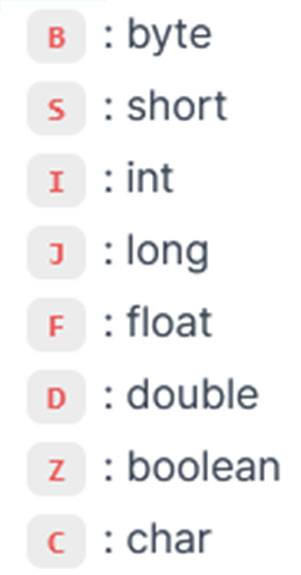

string: java.lang.String
string2: java.lang.String
string[]: [Ljava.lang.String

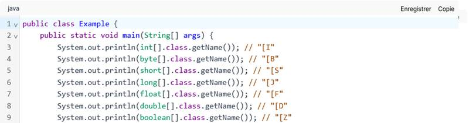

17/10/2025
Module de Programmation Avancée (application au langage Java)
27

### • System.out.println("string[]: "+String[].class.getName());

### • System.out.println("string2: "+st.getClass().getName());

### • System.out.println("string: "+String.class.getName());

# Comment décoder getName() de Class

• String st = "mon test";

---

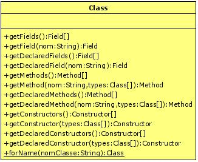

# La classe Class (hiérarchie et quelques fonctionnalités)

getDeclaredAnnotation(Class<A>)

getDeclaredClasses0()

| getDeclaredAnnotation(Class<A>) |
| --- |
| getDeclaredClasses0() |

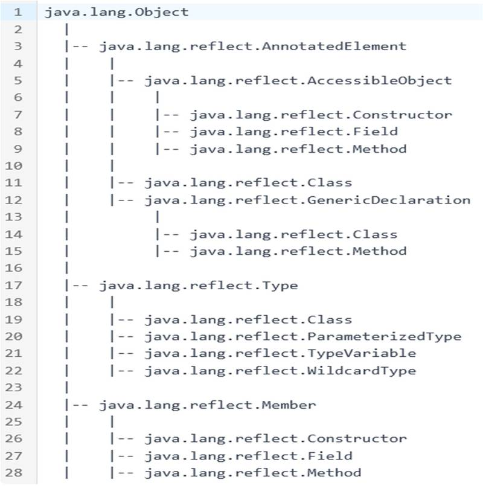

---

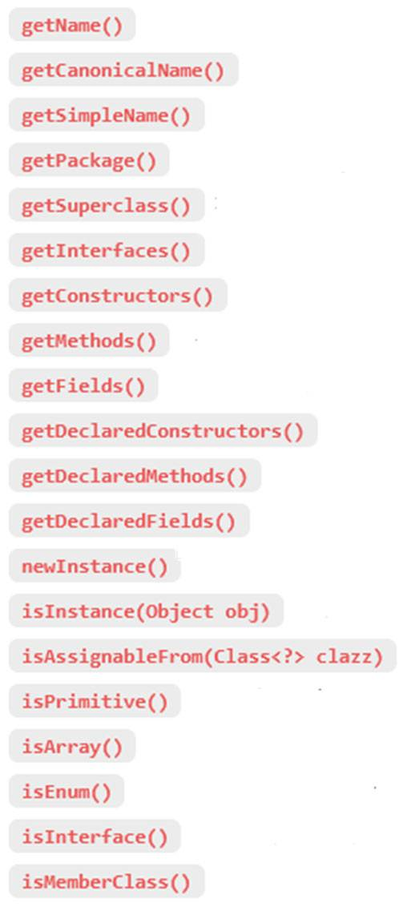

Module de Programmation Avancée (application au langage Java)
29
17/10/2025

•
public native boolean isInstance(Object obj); (= instanceof)

Method getEnclosingMethod()
getEnclosingclass()
Une interface est représentée par une 
instance de la classe Class

•
public <U> Class<? extends U> asSubclass(Class<U> clazz)

# Autres méthodes de la classe « Class <T>»

•
public native boolean isAssignableFrom(Class<?> cls)

•
public native Class<? super T> getSuperclass()

si le type de la classe est un tableau

•
public native boolean isInterface();

•
public Class<?> getComponentType()

•
String getName(): nom de la classe

•
public Class<?>[] getInterfaces()

•
String toString();

---

Class<?>[] getParameterTypes()
int getParameterCount()
Class<?> getReturnType
Type getGenericReturnType()
Method getRoot()
boolean isDefault() dans les 
interfaces, non abstraites, liens avec 
l’héritage multiple

Accès à toutes les informations :
-
champs,
-
méthodes,
-
Annotations
-
Paramètres des méthodes
-
Classes imbriquées
-
Etc.

Module de Programmation Avancée (application au langage Java)
30

Autres méthodes de Method :

Une interface est représentée par une 
instance de la classe Class

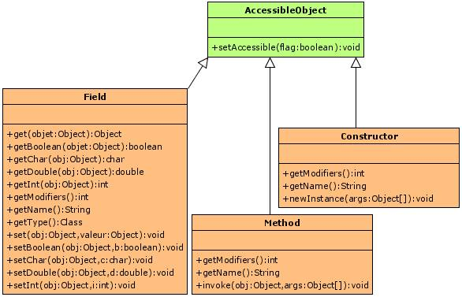

# Description des éléments d’une classe

Object

getParameterTypes()

Interface
AnnotatedElement

17/10/2025

---

17/10/2025
Module de Programmation Avancée (application au langage Java)
31

### • De nombreux langages propose de la réflexivité
• Introspection: voir les structures vs voir les objets
• Intercession : ajouter du comportement à une méthode / à l’appel d’une méthode
• Utilisation: Débogage (IDE), tests unitaires (JUNIT), préoccupations
transversales
• Java :
• Classe Class: rappel contenu….
• Classes Field (get, set), Method (invoke), Constructor (newInstance)
• Limitations: corps des classes

# Quelques Rappels de la séance précédente

---

Module de Programmation Avancée (application au langage Java)
32
17/10/2025

Utile pour charger des classes dont on ne connaît pas le nom à l'avance

String nomClasse = "java.lang.reflect.Array";

try {
Class<?> cl = Class.forName(nomClasse);
Method[] md = cl.getDeclaredMethods();
System.out.println(md[0].getName());
} catch (ClassNotFoundException x) {}

### public static Class<?> forName(String className)

# Charger une classe à partir de son nom

nomClasse : peut être un nom d’interface  ou de classe

---

### Object o = cl.newInstance();
(deprecated)

Module de Programmation Avancée (application au langage Java)
33

Objet cible + 
Dépend du 
constructeur si 
plusieurs dans la 
classe

Utile pour créer des instances de classes dynamiquement

throws InstantiationException, IllegalAccessException,
IllegalArgumentException, InvocationTargetException

try {
Class<?> cl = Class.forName(nomClasse);
Constructor<?>[] cc = cl.getConstructors();
Object o = cc[0].newInstance(…);
} catch (ClassNotFoundException | … x) {}

String nomClasse = « miage.m1.cm.Personne";

# Créer des instances sans utiliser « new »

nomClasse : peut être un nom d’interface  ou de classe

### public T newInstance(Object ... initargs)

17/10/2025

---

Module de Programmation Avancée (application au langage Java)
34

• Un objet de type Field ne contient pas la valeur de l’attribut  mais la 
« structure » de l’attribut
• f.getType() pour récupérer le type statique
• f.get(o).getClass.getTypeName() pour le type dynamique

try {
Class<?> cl = 
Class.forName(nomClasse);
Constructor<?>[] cc = cl.getConstructors();
Object o = cc[0].newInstance();
Field f = o.getClass().getField("age");
System.out.println(f.getInt(o));
} catch (ClassNotFoundException | … y) {}

String nomClasse = "miage.m1.td1.Personne";

# Voir le contenu d’un champ « public »

17/10/2025

---

Module de Programmation Avancée (application au langage Java)
35

Si besoin

• Un objet de type Field ne stocke pas la valeur de l’attribut  mais la 
« structure » de l’attribut
• f.getType pour récupérer le type statique
• f.get(o).getClass.getTypeName() pour le type dynamique

try {
Class<?> cl = 
Class.forName(nomClasse);
Constructor<?>[] cc = cl.getConstructors();
Object o = cc[0].newInstance();
Field f = o.getClass().getField("age");

### System.out.println("valeur:" + f.get(e));
} catch (ClassNotFoundException | … y) {}

# Modifier le contenu d’un champ « public »

String nomClasse = "miage.m1.td1.Personne";

f.set(o,2);

17/10/2025

---

…
Module de Programmation Avancée (application au langage Java)
36
17/10/2025

• Field f = cl.getField("age"); // age est un int
• Object v = f.get(p);
// v est un Integer
• La classe Field contient des primitives dédiées :

# Cas d’une classe avec des types prédéfinis

| getBoolean (Object): boolean | getInt (Object): int |
| --- | --- |
| getChar (Object) : char | getFloat (Object) : float |

•
La valeur lue est encapsulée
• Exemple :

---

### Class Exemple {
public ArrayList<Personne> tab_p;

Module de Programmation Avancée (application au langage Java)
37
17/10/2025

exemple () {
tab_p = new ArrayList();

type:java.util.ArrayList<miage.m1.td1.Personne>

}

# Cas d’une classe paramétrée (générique)

Exemple e;
e = new exemple();
Field f = e.getClass().getDeclaredField("tab_p");
Type t = f.getGenericType();

System.out.print("type:");
System.out.println(t.getTypeName());

Affichage :

Exemple :

---

Une solution pour simuler : p.getNom() où  ‘p’ une instance de Personne et ‘m’  représente la 
méthode getNom()
Method m = Personne.class.getMethod("getNom", null); 
String n = (String) m.invoke(p, null);

Module de Programmation Avancée (application au langage Java)
38
17/10/2025

# Invoquer dynamiquement une méthode (1)

### • Si on veut invoquer une méthode statique, o vaut null

### o est l'objet dont on veut appeler la méthode

### La classe Method possède
Object invoke(Object o, Object[] args);

### args est la liste des paramètres

Utiliser de java.lang.reflect.Method

---

Module de Programmation Avancée (application au langage Java)
39
17/10/2025

•
Si m représente setAge(int a) de la classe Personne
Method m = Personne.class.getMethod("setAge", Integer.class); 
Object[] args = {new Integer(33)}; 
m.invoke(p, args);

•
Dans le cas (paramètre et résultat) de types primitifs
utiliser les classes enveloppantes Integer, Float, Double, …

# Invoquer dynamiquement une méthode (2)

---

### Personne p1 = new Personne("Philippe L.");
Personne p2 = new Etudiant(" Henri L.")

17/10/2025
Module de Programmation Avancée (application au langage Java)
40

extends

Etudiant()
setAge(int i)

### Class Personne

### Class Etudiant

Personne()
setAge(int i)

### Sujet du premier TD

## • Analyse du contenu d’une classe

## • Analyse du contenu d’un objet

# Deux points de vue

---

public final class java.lang.Class<T> implements java.io.Serializable, java.lang.reflect.GenericDeclaration, java.lang.reflect.Type,

public static java.lang.Class<?> forName(java.lang.String, boolean, java.lang.ClassLoader) throws java.lang.ClassNotFoundException;

17/10/2025
Module de Programmation Avancée (application au langage Java)
41

# TD1 - Exercice 1 : Analyse du contenu d’une classe

public static java.lang.Class<?> forName(java.lang.String) throws java.lang.ClassNotFoundException;

public T newInstance() throws java.lang.InstantiationException, java.lang.IllegalAccessException;

public static java.lang.Class<?> forName(java.lang.Module, java.lang.String);

transient java.lang.ClassValue$ClassValueMap classValueMap;

public native boolean isAssignableFrom(java.lang.Class<?>);

public native boolean isInstance(java.lang.Object);

public java.lang.ClassLoader getClassLoader();

public java.lang.String toGenericString();

java.lang.reflect.AnnotatedElement {

public native boolean isInterface();

public native boolean isPrimitive();

public java.lang.String getName();

public java.lang.String toString();

public native boolean isArray();

public boolean isAnnotation();

public boolean isSynthetic();

## ………

---

17/10/2025
Module de Programmation Avancée (application au langage Java)
42

# TD1 - Exercice 1 : Analyse du contenu d’une classe

public static void analyseClasse(String nomClasse) throws ClassNotFoundException {
Class cl = …

// L'accolade de fin de classe !
System.out.println("}");
}
….

public class AnalyseurDeClasse {

afficheConstructeurs(cl);

afficheEnTeteClasse(cl);

afficheInnerClasses(cl);

afficheMethodes(cl);

afficheAttributs(cl);

---

Module de Programmation Avancée (application au langage Java)
43
Object et Class sont le point de départ qui permet d’accéder à « tout »

Deux classes dans Java.Lang:
• La classe Class
• La classe Object
Dans java.lang.reflect:
• Trois classes : Field, Method, Constructor
• Mais aussi d’autres: Modifier, etc.
• Les quatre classes (Class…Constructor) possèdent getName()
• Field possède getType() qui renvoie un objet de type Class
• Method et Constructor ont des méthodes pour obtenir le type de 
retour et le type des paramètres et surtout des méthodes pour les 
exécuter

# Analyser une classe (1): la structure d’une classe

17/10/2025

---

• Field, Method, Constructor possèdent getModifiers() qui renvoie un int, 
Interprétation de l’entier bit par bit (0 ou à 1):  signifient static, public, private, etc…
• On utilise les méthodes statiques de java.lang.reflect.Modifier pour interpréter cette valeur :
• String toString(int)
• boolean isFinal(int)
• boolean isPublic(int)
• boolean isPrivate(int)
• …
• Field, Method, Constructor (d’autres méthodes):
• Class getDeclaringClass()
• Class[] getExceptionTypes() et Class[] getParameterTypes()
Constructor et Method uniquement (Executable)

Module de Programmation Avancée (application au langage Java)
44
17/10/2025

# Analyser une classe (2) : reconnaitre les « modifiers »

---

Quelques informations complémentaires :
• Le lieu de la déclaration  (classe): getDeclaringClass()
• Le type « statique » du champ (Classe, primitif ou générique): getType() et getGenericType()
• Annotations (voir chapitre du cours concerné)

Module de Programmation Avancée (application au langage Java)
45

• Field[] getFields() : 
Ne renvoie que les champs publics, locaux et hérités
• Field[] getDeclaredFields():
Renvoie tous les attributs locaux uniquement
• Ces deux méthodes renvoient un tableau de longueur nulle si
• Pas de champs
• La classe est un type prédéfini (int, double…)

# Analyser une classe (3): Les champs

17/10/2025

---

Module de Programmation Avancée (application au langage Java)
46
17/10/2025

# Analyser une classe (4): les méthodes / constructeurs

• Method[] getMethods()
Ne renvoie que les méthodes publiques, locales et héritées
• Method[] getDeclaredMethods()
Renvoie toutes les méthodes locales uniquement
• Constructor[] getConstructors()
Ne renvoie que les constructeurs publics
• Constructor[] getDeclaredConstructors()
Renvoie tous les constructeurs
• Accéder aux paramètres : classe Parameter
• Assez proche des fonctionnalités offertes par la clase FIELD: getType, 
getParameterizedType, annotations, etc.

---

17/10/2025
Module de Programmation Avancée (application au langage Java)
47

# TD1 - Exercice 2 :  Réaliser une méthode toString() générique

Utiliser l'introspection pour créer une méthode toString() générique. Il s'agit en 
pratique de faire une méthode toString qui prend en paramètre un objet de type 
Object et affiche la valeur de chacun de ses champs. Attention, si les champs sont 
des références sur d'autres objets on descendra en profondeur pour afficher 
"récursivement" leur valeur également.

Pour permettre « l’arrêt » du programme, la méthode toString aura un deuxième 
paramètre qui est la profondeur à laquelle on souhaite descendre.

### ………

---

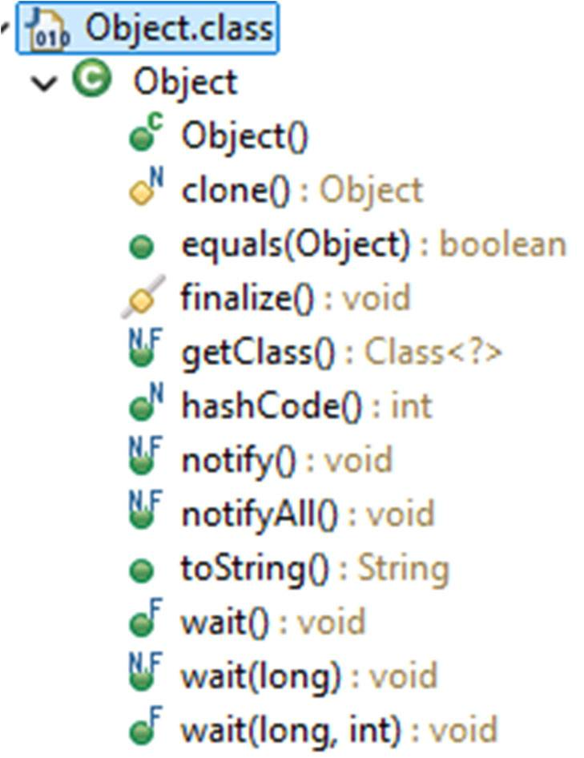

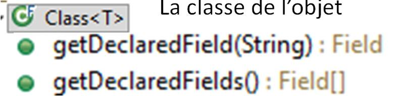

La classe de l’objet

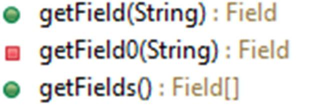

### Comment obtenir la valeur des champs d'un objet
• on ne connaît pas l'objet à examiner à l'avance 
• On ne connaît pas sa classe

# Analyser un objet de type inconnu (1)

Obtenir un objet de type Class
Appeler getDeclaredFields() sur l'objet obtenu

| Lahire |
| --- |
| Philippe |
| … |
|  |

Philippe

Lahire

…

---

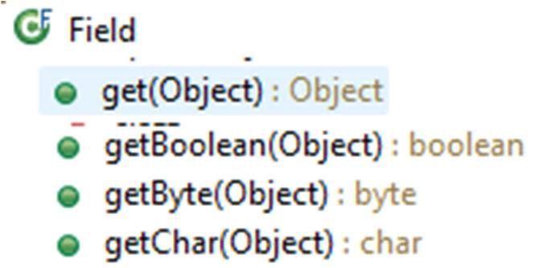

Philippe

Lahire

…

### f.get(obj) renvoie la valeur de l'attribut f de l'objet obj

Si obj est un objet de la classe dont f est le champ Alors

• Utiliser la méthode get(Object obj) de la classe Field
• Un type primitif la valeur est encapsulée dans un objet
• Un champ statique: le paramètre est ignoré
• Le champ doit être accessible (dépend des « modifiers »)
• Gestion d’exceptions: accès illégal, type non conforme

| Lahire |
| --- |
| Philippe |
| … |
|  |

# Analyser un objet de type inconnu (2)

### Si f est un objet de type Field Alors

Accéder à la valeur d'un champ

17/10/2025

---

public Personne(
String nom, 
String prenom, int age) {

Module de Programmation Avancée (application au langage Java)
50
17/10/2025

private String prenom;

this.nom = nom;

private String nom;

this.age = age;
}
}

public class Personne {

|  |
| --- |
| { |

private int age;

# Analyser une instance de type connu (1)

### On ne peut pas accéder à tout 
Par défaut, le mécanisme de réflexion respecte le 
contrôle des accès.
• Exemple :Le champ "prenom" est private !
• Génération d’une exception: IllegalAccessException

### On connait une instance et le nom des champs :

Personne p = new Personne("R.", "Philippe", 33);
…
Class cl = p.getClass();
Field f = cl.getField("prenom");
Object v = f.get(p);
System.out.println(v);

---

On peut voir les champs d’un objet mais pas toujours consulter leur valeur
Solutions de contournement :
• mettre l'attribut "prenom" public
• mettre le code dans la classe Personne
• si un programme Java n'est pas contrôlé par un gestionnaire de sécurité (policy manager) 
qui le lui interdit, il peut outrepasser son droit d'accès. 
Invoquer la méthode setAccessible(boolean) d'un objet Field, Method ou Constructor
• Autre méthode (méthode statique) :

Module de Programmation Avancée (application au langage Java)
51
17/10/2025

AccessibleObject.setAccessible(AccessibleObject[] array, boolean flag)

# Analyser une instance de type connu (2)

---

Module de Programmation Avancée (application au langage Java)
52
17/10/2025

Personne p = new Personne("R.", "Philippe", 33);
…
Class cl = p.getClass();

# Analyser une instance de type connu (3)

Field f = cl.getField("prenom");

f.setAccessible(true);

Object v = f.get(p);
System.out.println(v);

## Code mis à jour :

---

java.lang.Object[]

Module de Programmation Avancée (application au langage Java)
53
17/10/2025

static Object[] AgrandirTailleTableau(Object[] tab, int newLength) { 
Object[] newTab = new Object[newLength];

### String[] ts = (String[]) newTab;
Impossible : Object n’hérite pas de String

### System.arraycopy(tab, 0, newTab, 0, 
Math.min(tab.length, newLength));
return newTab;
}
Application :

### …
String[] oldTab = {"aaa","bbb","ccc","ddd"};
newTab = AgrandirTailleTableau(oldTab, 5);
System.out.println(newTab.getClass().getTypeName());

### Exemple d’utilisation : Augmenter la taille d’un tableau

# Utilité des mécanismes réflexifs (1)

---

Object newTab = AgrandirTailleTableau2(oldTab, 5);
System.out.println(newTab.getClass().getTypeName());
String[] newTab2 = (String[]) newTab;
java.lang.String[]

Module de Programmation Avancée (application au langage Java)
54
17/10/2025

java.lang.String

# Utilité des mécanismes réflexifs (2)
Exemple d’utilisation : Augmenter la taille d’un tableau
• Utilisation de java.lang.reflect.Array , java.lang.Class et java.lang.Object
• Array permet de créer des instances et de lire ou modifier les éléments
static Object AgrandirTailleTableau2(Object[] tab, int newLength) { 
Class type = tab.getClass().getComponentType();
Object newTab = Array.newInstance(type, newLength);
int oldLength = Array.getLength(tab);
for (int i=0;i<Math.min(oldLength, newLength);i=i+1) {
Array.set(newTab, i, tab[i]);
}
return newTab;
}

---

public void testAdditionnerSiPetit() throws Exception {
assertEquals(2, ExempleClasse. additionnerSiPetit(1,1));
} }

java -cp junit.jar;. junit.textui.TestRunner ExempleClasseTest

•
Dans C.getDeclaredMethods() rechercher les méthodes de ExempleClasse qui contiennent « test » devant et 
les associer à « m »
•
m.invoke(i)*

17/10/2025
Module de Programmation Avancée (application au langage Java)
55

import junit.framework.*;
public class ExempleClasseTest extends TestCase {

# JUNIT3 : Un exemple de mise en œuvre de l’introspection

Autre approche possible ?

Exécution par introspection :
•
c = Class.forName(« ExempleClasse » + « Test »)
•
Vérifier qu’elle est sous classe de TestCase + créer une instance i

### * I ou null : méthode d’instance ou de classe

public class ExempleClasse {
public static int addSiPetit (int a, int b) {
! Le résultat doit être inférieur à 100
int res = a + b;
if (res) > 100 res = -1
return res; 
}
}

---

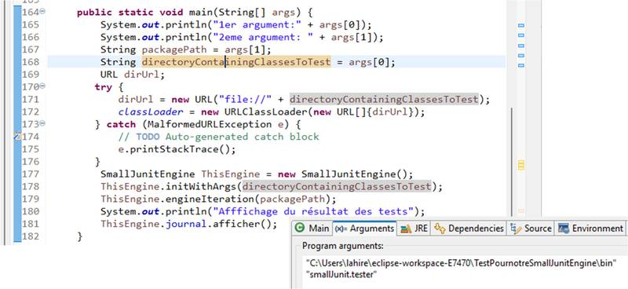

17/10/2025
Module de Programmation Avancée (application au langage Java)
56

# Liaison entre le moteur de test et les applications